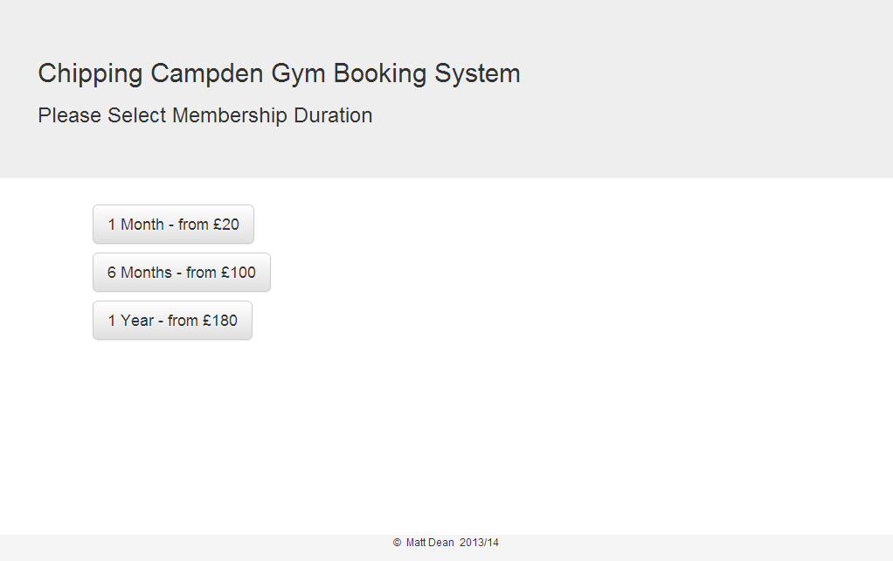
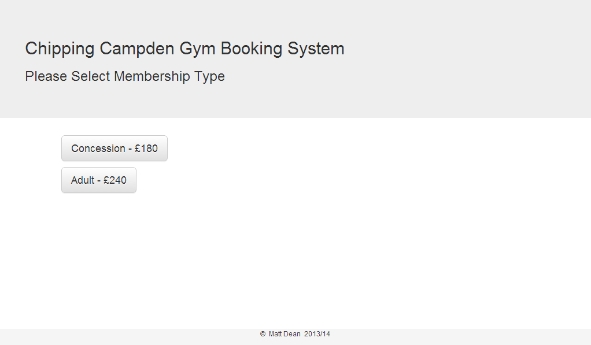
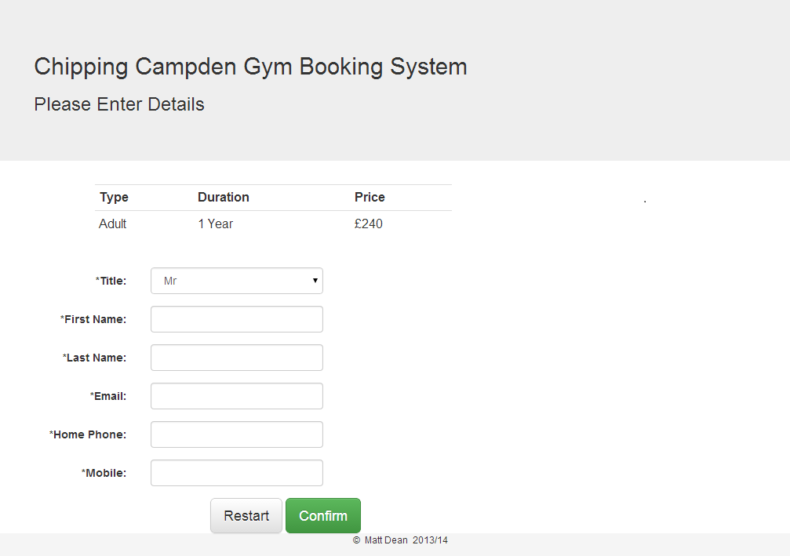
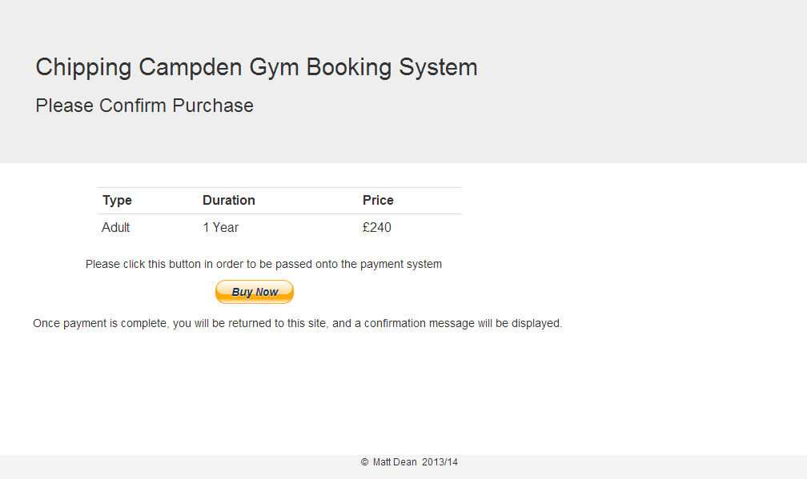
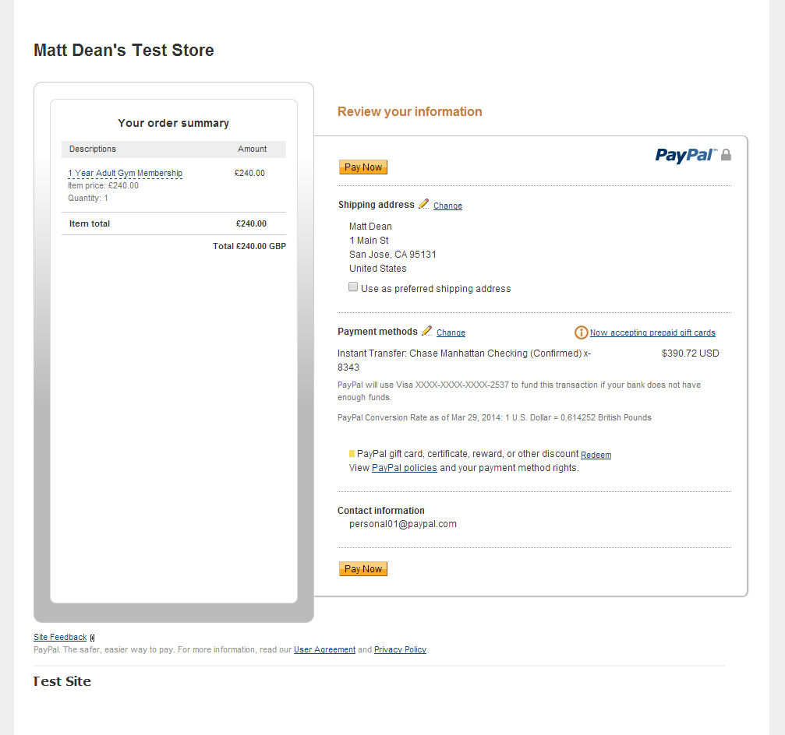
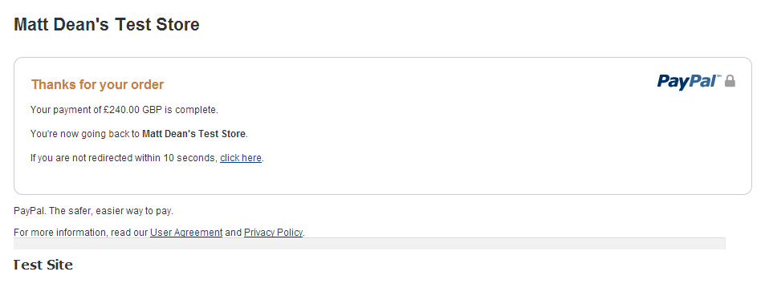
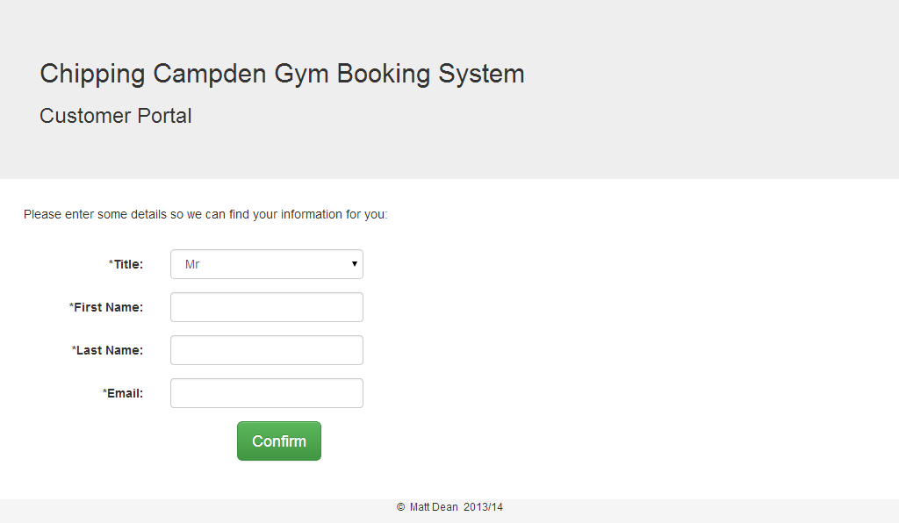
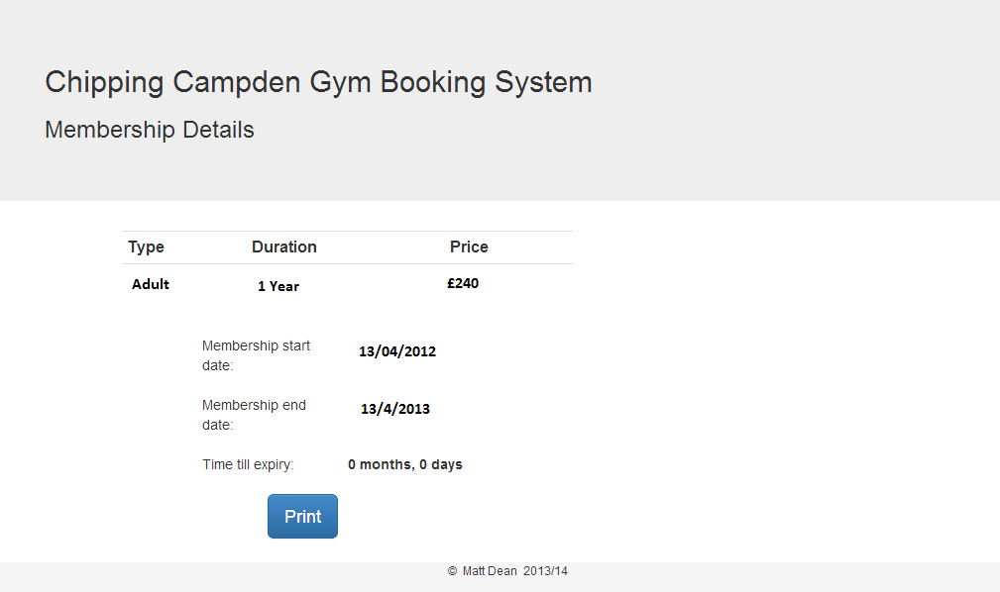

# gym
a gym membership purchase system

Finally got to implement a working payment system!

####The Project
I created a membership booking and payment system for my local gym in PHP, using a MySQL Database.

Customers are asked what type/duration o0f membership they would like:

They then enter their details and receive a summary of the order:

Now we take them through PayPal (in sandbox mode):

our database is updated (and the customer receives an email) by calling ipn2.php through PayPal's Instant Payment Notification system

The customer is redirected from PayPal back to our site, so we can show them a comforting conformation message, and link them to our portal, where they can view their current memberships:

