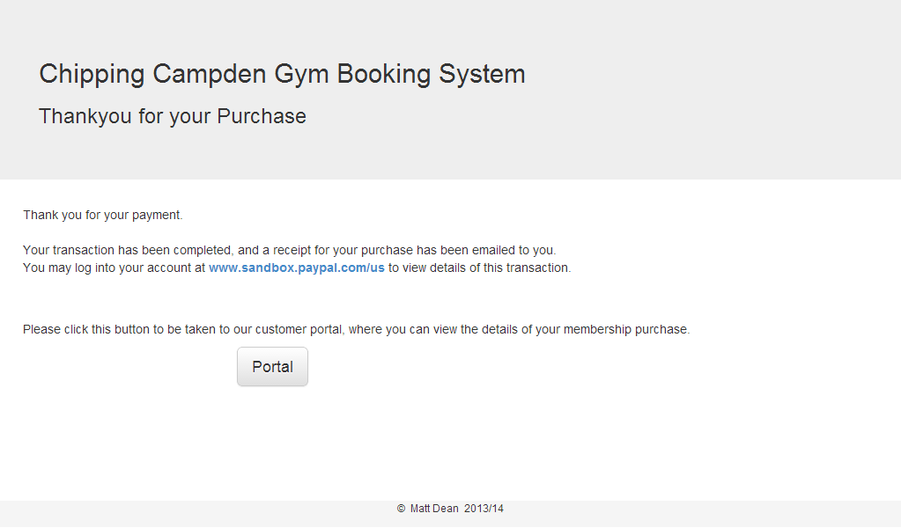

# gym
a gym membership purchase system for A2 Computing, 2013-14

The next step on the coding ladder, I improved my PHP and MySQL skills, and got to grips with the Bootstrap CSS framework.

I also finally got to implement a working payment system!

####The Project

Customers are asked what duration/type of membership they would like:

They then enter their details and receive a summary of the order:

Now we take them through PayPal (in sandbox mode):

our database is updated (and the customer receives an email) by calling ipn2.php through PayPal's Instant Payment Notification system

The customer is redirected from PayPal back to our site, so we can show them a comforting conformation message, and link them to our portal.

The portal allows customers to view their current membership stats.

